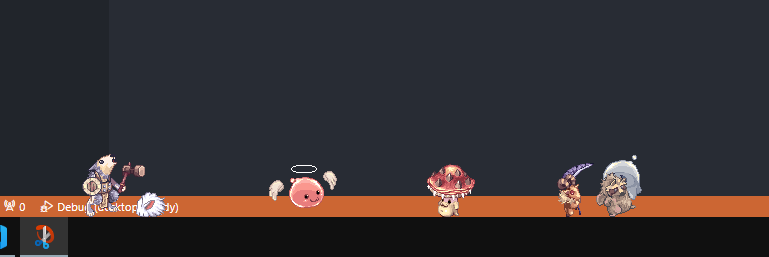

<b>Ragnarok desktop buddy</b>

# All assets belong to GRAVITY Co. Ltd. This project is not affiliated with them.

#### Instructions
1. Download the latest release [here](https://github.com/gccruz93/ragnarok-buddy/releases).
2. Run the exe.
3. A cfg.ini file will appear in the same folder, configure as you like. Or just right click the tray icon on your taskbar!
4. Enjoy your new pets!

#### Features
- Available pets: Angeling, Baphomet Jr., Ghostring, Kobold Axe, Kobold Hammer, Kobold Mace, Lunatic, Poring, Smokie, Spore. More coming soon...
- Hover a pet for a moment to remove it.
- A new random pet will spawn until reaches the limit configured.

#### Features on the way
- More pets, sounds, effects and "gamemodes".

#### Preview

